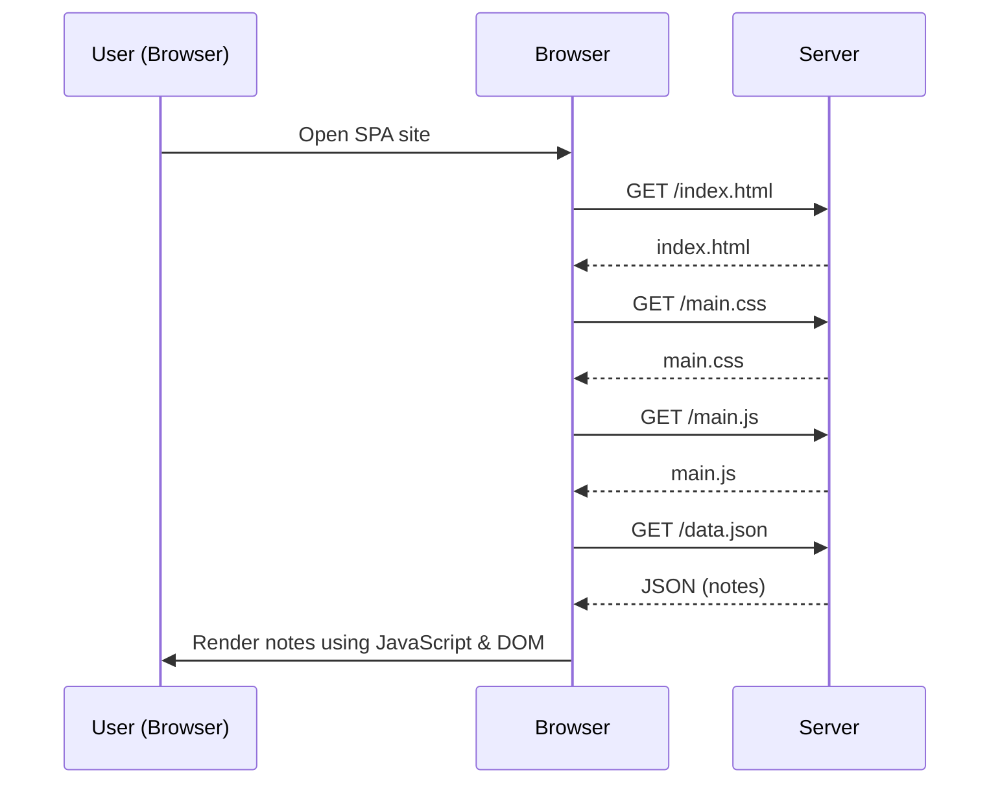

```mermaid
  sequenceDiagram
    participant User as User (Browser)
    participant Browser as Browser
    participant Server as Server

    User->>Browser: Open SPA site
    Browser->>Server: GET /index.html
    Server-->>Browser: index.html
    Browser->>Server: GET /main.css
    Server-->>Browser: main.css
    Browser->>Server: GET /main.js
    Server-->>Browser: main.js
    Browser->>Server: GET /data.json
    Server-->>Browser: JSON (notes)
    Browser->>User: Render notes using JavaScript & DOM

```