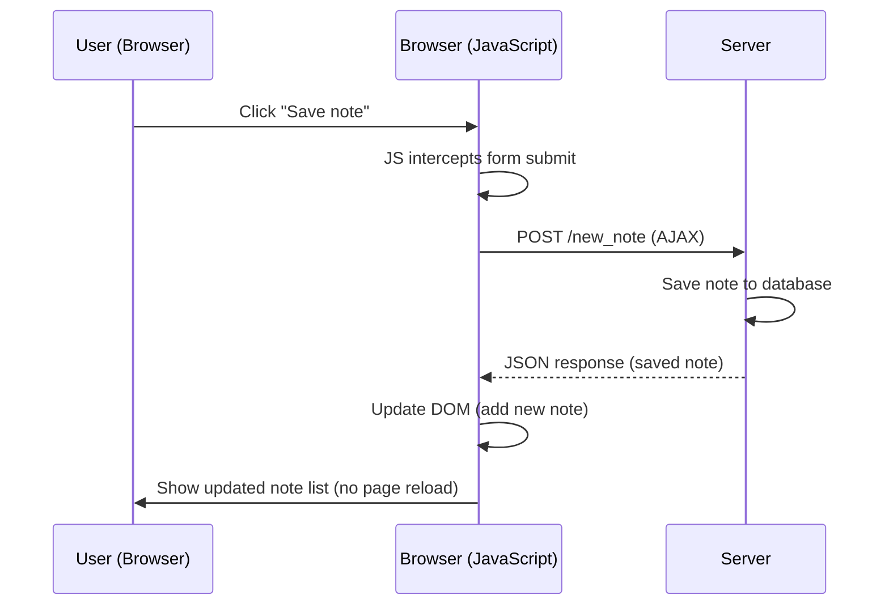

```mermaid
  sequenceDiagram
    participant User as User (Browser)
    participant Browser as Browser (JavaScript)
    participant Server as Server

    User->>Browser: Click "Save note"
    Browser->>Browser: JS intercepts form submit
    Browser->>Server: POST /new_note (AJAX)
    Server->>Server: Save note to database
    Server-->>Browser: JSON response (saved note)
    Browser->>Browser: Update DOM (add new note)
    Browser->>User: Show updated note list (no page reload)

```